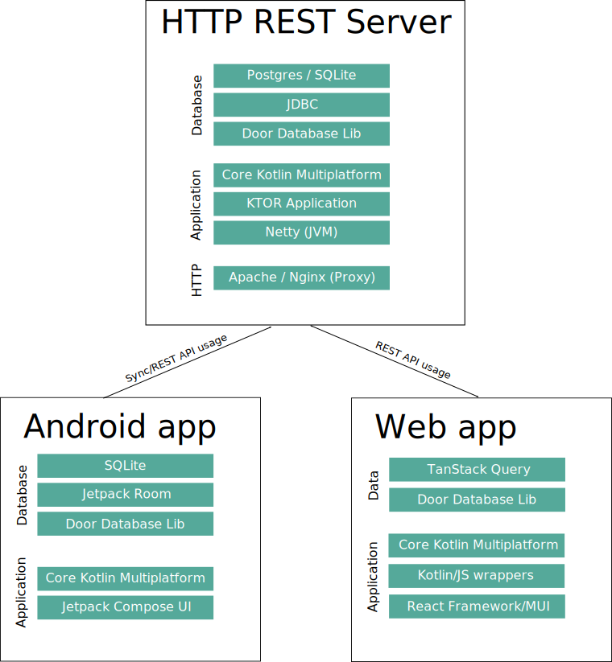

# Diagram

# Environment constraints:
* **Limited (or no) connectivity** - connectivity: may or may not be available, if connectivity is available, it may have limited bandwidth, high latency, and packet loss. Connectivity when available is often metered.
* **Low-end devices**: devices are often low memory (e.g 512MB - 1GB RAM on Android, 4GB on desktop PCs), with limited storage space (e.g. 8-16GB) - such as Android Go. Devices will often use an older version of the Android OS (e.g. second hand devices etc).
* **Limited number of / access to devices**: devices are more likely to be shared between students, family members etc.

# Architecture objectives:
* Provide the maximum functionality possible with the minimum connectivity requirement eg.
    * Able to run queries offline-first without requiring access to the backend to run any processing / analytics etc (eg. attendance reports, usage data, etc)
    * Able to run all functions on the mobile / desktop app offline-first without connectivity and sync when a connection is available (e.g. record attendance, syncs when connection available).
    * Able to sync between nearby devices (e.g. teacher device student device) without requiring an Internet connection
    *  Minimize Internet bandwidth used
* Maximize code re-usage between platforms: avoid rewriting business logic for different platforms eg. database queries used to run reports, validation logic on screens, etc.
* Provide a native UI on each platform that is as performant as possible, ensuring acceptable performance on low-end devices (especially Android).
* Integrate with platform level networking APIs (e.g. Bluetooth, Network Service Discovery, WorkManager on Android to sync when a connection is available without requiring user to open app, etc)
* Maximize developer productivity and make the project as simple to work with for newcomers as reasonably possible.

# Architecture decisions

* **Code sharing using [Kotlin Multiplatform](https://kotlinlang.org/docs/multiplatform.html)**. Kotlin 
  Multiplatform (unlike other multiplatform solutions) is not all or nothing. It allows sharing core 
  logic between platforms (Android, JVM/Desktop, JVM/Server and JS) such as validation logic, 
  SQL queries, ViewModels, and (because it is compiled to native code) can straightforwardly 
  interoperate with native libraries without the need to create plugins etc. for each use case. 
  Native apps (e.g. on Android/desktop) can access the full 
  platform network stack as needed to use Bluetooth APIs, wifi APIs, etc. Each platform can provide 
  a native UI and native performance.
* **Offline-first data layer**: data layer (e.g. database rows such as user details, progress, 
  content catalog, etc) is accessed via an offline-first datasource. Changes are made to the local
  database and updated to/from the server as/when a connection is available. This is done using
  [Door](https://www.github.com/UstadMobile/door). Data can be pushed (e.g. if a user selects to 
  sync a particular course or other data set) or pulled on-demand (e.g. when accessing a particular
  screen). Not all data a user can access is synced because this leads to forcing users to wait for 
  a sync to complete and often wastes a lot of bandwidth and storage (especially when a user e.g.
  admin might have access to a lot of data that they are very unlikely to access at a granular 
  level).
* **Follow Android architecture recommendations** for [layered architecture](https://developer.android.com/topic/architecture/recommendations#layered-architecture), [UI layer](https://developer.android.com/topic/architecture/recommendations#ui-layer), [ViewModel](https://developer.android.com/topic/architecture/recommendations#viewmodel), [Models](https://developer.android.com/topic/architecture/recommendations#models).  Business logic is contained in a ViewModel which provides a Flow of UiState data (e.g. the entity/entities being displayed to the user, validation messages, etc). Events are passed to the ViewModel, which then updates the UiState. See [CODING-STYLE.md](CODING-STYLE.md).
* **Testing: unit, integration, end-to-end** it is critical for the app to work as expected for users without needing manual testing for all key functionality. Use [Maestro](https://maestro.dev) for Android end-to-end, [Cypress](https://cypress.io/) for the web/desktop.   

# Platform stacks

* **Backend HTTP server**: [KTOR HTTP](https://ktor.io) server. Database connection using JDBC 
  (mostly using endpoints generated by Door) to PostgreSQL or SQLite. Can use any standard http 
  server (e.g. Apache or Nginx) to provide a reverse proxy, certificate management, etc.
* **Android client**: Native Android app using [Jetpack Compose UI](https://developer.android.com/jetpack/compose).
  Local data is stored using [Jetpack Room Database](https://developer.android.com/training/data-storage/room)
  and the online/offline repository is managed by Door.
* **Web client**: React app written in Kotlin using Kotlin/JS, [kotlin-wrappers](https://github.com/JetBrains/kotlin-wrappers) 
  for [React](https://react.dev) and [MUI user interface](https://mui.com/). Screens are built 
  as functional React components and reuse the same ViewModel used on Android. [SQL.js](https://sql.js.org)
  is used to run the same SQLite database within the browser as is used the Android and desktop app. 
  See [app-react](app-react).
* **Desktop**: JVM application built using [Jetpack Compose Multiplatform](https://www.jetbrains.com/lp/compose-multiplatform/). 
  This allows re-using the vast majority of the UI built for Android to run on the desktop. Door
  is used to manage an SQLite database.

# Offline-first architecture

Content that is to be accessible offline should behave as outlined below. Content can be hosted by
the Ustad server, however it can also be hosted by any other platform that provides an endpoint that
complies with the guidelines below. Users can upload content files (e.g. videos, epubs, H5P, 
TinCan zip, PDF, etc)to a server, it will then provide a URL for that content which complies with the 
steps outlined below. This allows content to be added to a course or library in a given system without
being stored on that particular server (e.g. where various schools each have their own instance with 
a separate URL but share common content).

* Any version of a piece of content should be accessible via a URL and have an associated sitemap.xml eg.: 
  http(s)://server.com/api/content/contentEntryUid/versionId/ . The sitemap.xml should list all urls
  required for use of the content.
* The sitemap.xml SHOULD have the sha-256 checksum of each static resource to allow the client to 
  avoid downloading
  the url if it already has the same data (e.g. a resource such as an image, Javascript, etc that is
  used in another content item), even where that item would otherwise have a different url. The
  sha256 checksum should match the value that would be provided for 
  [Subresource Integrity](https://developer.mozilla.org/en-US/docs/Web/Security/Subresource_Integrity)
  e.g. it must apply for the entire body and should be applied before any transfer-encoding 
  (e.g. gzip).
* When opening a content piece the client will first load the sitemap.xml. For each request, where 
  the SHA-256 checksum is known, the client will use local data if it already has a copy of the given
  resource, otherwise it will download the resource from the given url. If a user selects to make a
  content piece available offline, it will download all the resources listed in sitemap.xml that are
  not yet stored locally.

# Learning Spaces

Learning Spaces are to Ustad Mobile what a workspace is to Slack. Each space has its own users,
classes, library, etc. Schools, projects, companies, etc can each have their own learning space. 
Each Learning Space will have a specific URL.

## Client side

The client will have a separate instance of the main database (UmAppDatabase) for each learning 
space. This is used for [scoped](https://kosi-libs.org/kodein/7.22/core/using-environment.html#scope)
dependency injection.

## Server side (virtual hosting)

One server process (in one JVM instance) can host multiple learning spaces with minimal overhead. 
HTTP requests are matched to the relevant learning space, and each learning space is mapped to a 
separate database. [lib-systemdb](lib-systemdb/) is used to maintain a database of all learning 
spaces available on the system.

