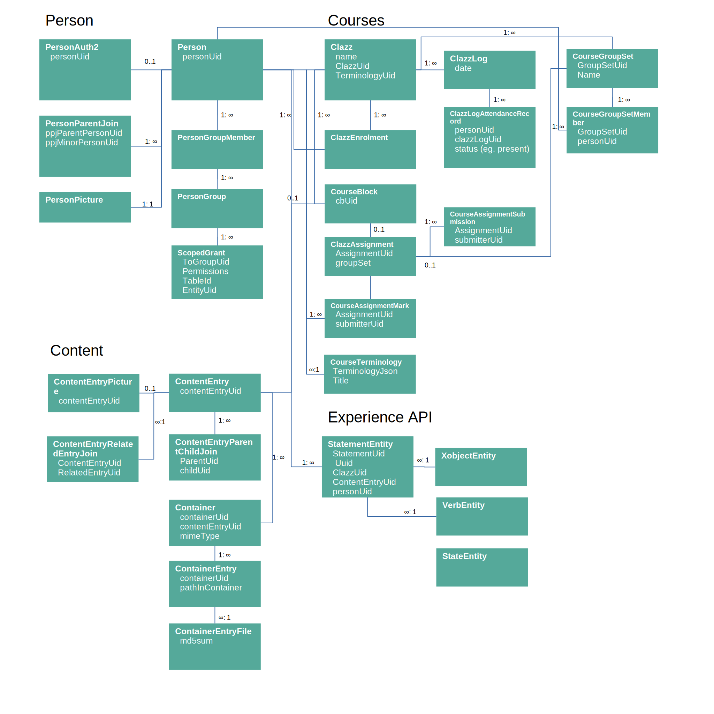

# Database schema

  

The schema diagram is not exhaustive, however it maps the main entities. Foreign key constraints
are NOT allowed because the sync process cannot guarantee the order in which entities arrive.

The database is contained in [lib-database](lib-database/) and is built using [Door](https://www.github.com/UstadMobile/door)
and [Room](https://developer.android.com/training/data-storage/room). If you are familiar with Room
database on Android, it should be straightforward. Door essentially extends Room to work on 
JVM and Javascript using Kotlin Multiplatform.

All entities and DAOs can be found in [UmAppDatabase.kt](lib-database/src/commonMain/kotlin/com/ustadmobile/core/db/UmAppDatabase.kt).
