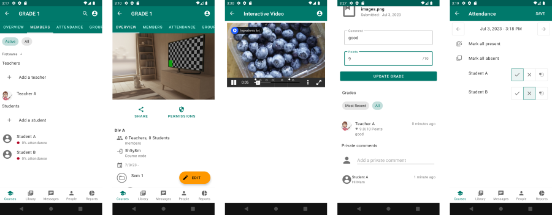

# Ustad Mobile



Branch downloads:

Android APKs, Server builds: [https://devserver3.ustadmobile.com/jobs/Release-Maktab/](https://devserver3.ustadmobile.com/jobs/Release-Maktab/)

Desktop installers: [https://devserver3.ustadmobile.com/conveyor/Release-Maktab/](https://devserver3.ustadmobile.com/conveyor/Release-Maktab/)

Ustad Mobile enables users to teach, learn, and share: online or offline. It is a learning
management system (LMS) built from the ground up to work with or without connectivity. Features 
include:

* Online and offline usage of eLearning content with support for Experience API (xAPI), H5P, ePub, 
  PDF, and videos.
* Assignments where students can submit work to be marked by their teacher or other students (peer
  marking). 
* Discussion boards
* Attendance and enrolment tracking
* Course structuring for course authors to structure content, assignments, discussion boards, text, 
  and (optionally) assign points for completion.
* Offline sync that works via any Internet connection or via nearby devices (e.g. from teacher device
  to student device etc). With a class of 30 students this reduces bandwidth consumption 97%+ whilst
  supporting data sync to the Internet when a connection is available.

Want to collaborate on development? Join us on discord: [https://discord.gg/WHe35Sbsg4](https://discord.gg/WHe35Sbsg4).  

## Translations

Ustad Mobile is currently available in English, Dari, Pashto, and Tajik. Translation is done using 
on our [Weblate project](https://hosted.weblate.org/projects/ustad-mobile/). You do not need to be a
programmer! Please register on Weblate and then [create an issue](https://github.com/UstadMobile/UstadMobile/issues/new)
with the subject "Localization - language name" and let us know what language you would like to
translate into. We can then give you permission to start translating!

Translations are stored as Android strings XML resource files in [core/src/commonMain/resources/MR](core/src/commonMain/resources/MR).
The project uses [Moko-Resources](https://github.com/icerockdev/moko-resources) to make strings 
available on all platforms (including JVM and Javascript).

If adding a new language it should be added to the constant in in 
[SupportedLanguagesConfig.kt](core/src/commonMain/kotlin/com/ustadmobile/core/impl/config/SupportedLanguagesConfig.kt)
 and app-android/build.gradle resConfigs should be updated. Add the language name to 
[UstadMobileConstants.kt](core/src/commonMain/kotlin/com/ustadmobile/core/impl/UstadMobileConstants.kt).

## Contributing

Contributions are welcome, there are many ways to contribute as a developer, translator, or user. 
See the [CONTRIBUTING.md](CONTRIBUTING.md) for details. If you're unsure
about anything, please join our [discord server](https://discord.gg/WHe35Sbsg4) or create an issue
here on GitHub and label it as a question.

## Documentation for users

The documentation here on Github is intended for those who are contributing to the project (inc 
translation, software development, bug reporting, testing, etc) and technical users (e.g. developers, 
server admins). If you want documentation for end users, please see the manual on ReadTheDocs at 
[https://ustadmobile.readthedocs.org/](https://ustadmobile.readthedocs.org/)

## Installing on a server (self-hosting)

See [INSTALL.md](INSTALL.md) for instructions for installation on your own server using binary 
downloads.

## Development environment setup:

These instructions are intended for developers who wish to build/run from source code. 

This is a Kotlin Multiplatform project. This repository contains the Android app, web app, and
backend server source code in its modules. Android Studio is the development environment for the 
entire project. 

*  __Step 1: Download and install Android Studio__: If you don't already have the latest version, download 
from [https://developer.android.com/studio](https://developer.android.com/studio). _Make sure Android SDK Command Line Tools are
installed_. In Android Studio: Menu - Tools - SDK Manager - SDK Tools Tab - Check
Android SDK Command Line Tools (Latest).

* __Step 2: Install dependencies__
 
Development requirements are:
* JDK17 (only): JDK21 not supported yet due to Proguard issues on app-desktop.
* MediaInfo: MediaInfo is used by the server and desktop version to validate media files and extract
  metadata
* VLC (3.0.0)+ : VLC is used on the desktop version (via VLC4J) to play videos and by both the server
  and desktop version to extract video thumbnails
* HandBrakeCLI (1.6.0+): HandBrake (Command Line Interface) is used by the server and desktop version 
  to compress videos.
* SOX (14+) : Sox is used to transcode audio files

Linux:

If you already have JDK 17 installed, you can use it.

OpenJDK17, mediainfo, and vlc, can be installed using the system package manager e.g.

```
sudo apt-get install openjdk-17-jdk mediainfo vlc sox libsox-fmt-all
```

If using Ubuntu 23.10+, you can use the HandBrakeCLI from the Ubuntu package manager (1.6.1):
```
apt-get install handbrake-cli
```

Previous versions (including 22.04 LTS) has HandBrake 1.5 (which is not supported due to lack of 
AV1 support). You can install the latest HandBrake CLI using flatpak as per [HandBrake website](https://handbrake.fr/downloads2.php):
```
apt-get install flatpak
flatpak install /path/where/downloaded/HandBrakeCLI-1.7.3-x86_64.flatpak
```

Ghostscript (optional): The ghostscript (gs) command can be used to compress PDFs. 
```
apt-get install ghostscript
```

Windows: 

__JDK__
Download and install Java (JDK17) if not already installed from the Java site
[https://www.oracle.com/java/technologies/downloads/#jdk17-windows](https://www.oracle.com/java/technologies/downloads/#jdk17-windows)

The installer should automatically put the java command into the system PATH environment variable.

If you need to do this manually, search for "Environment Variables" in Windows - then 
"Edit the system environment variables". Create a new environment variable. Set the variable name to 
JAVA_HOME and set the value to the directory where you have installed Java.

Now find the PATH variable. Append ```;%JAVA_HOME%\bin``` to the value and save it. 

Further details: see the [Java website](https://www.java.com/en/download/help/path.html).

__VLC__
Download and install from [https://www.videolan.org/](https://www.videolan.org/). Make sure to choose
a 64bit version (using a non-64bit version will fail). VLC is used by the Desktop version to play 
videos via VLCJ.

__MediaInfo__
Download and install such that the MediaInfo command is in the PATH. This can be done using winget:

```
winget install -e --id MediaArea.MediaInfo
```

__HandBrakeCLI__
Download and install such that the HandBrakeCLI command is in the PATH. This can be done using winget:

```
winget install -e --id HandBrake.HandBrake.CLI
```

__Sox__
Download and install from the [Sox website](https://sourceforge.net/projects/sox/files/sox/14.4.2/) (the Winget package does not work because it does not get
added to the path).

__Mpg123__

Mpg123 is required on Windows because the SoX Windows binary cannot read mp3 files. Download it from 
the [Mpg123 Website](https://www.mpg123.de/download/win32/) and unzip it into the commands directory.
Alternatively, you can put it in your PATH environment variable or manually specify the location in
ustad-server.conf.

__GhostScript (optional)__
Ghostscript (if installed and detected on the system path) can be used to compress PDFs. It can be 
installed using winget:
```
winget install -e --id ArtifexSoftware.GhostScript
```


* __Step 3: Import the project in Android Studio__: Select File, New, Project from Version Control. Enter
https://github.com/UstadMobile/UstadMobile.git and wait for the project to import. Switch to the
  dev-mvvm-primary branch (Menu: Git - Branches - search for dev-mvvm-primary - checkout ).

* __Step 4: Build/run the server__: Run the server locally:

Linux/MacOS:
```
$ ./runserver.sh --siteUrl http://your.ip.address:8087/
```

Windows:
```
$ runserver.bat --siteUrl http://your.ip.address:8087/
```

The siteUrl parameter must match the address that you use to access the system (e.g. in the browser
or when entering the link on the Android app). 

As above, your.ip.address is your IP address (e.g. 192.168.1.2). If the siteUrl changes and the old 
site url is inaccessible, then this may make content uploaded before the change inaccessible.

This will start the server on port 8087. The admin password will be randomly generated - you can find
it in app-ktor-server/data/singleton/admin.txt .

This will run the REST API which is required by the Android and web apps. It will not include the 
web client app itself. To use the web client app in the browser, you must build/run it (as below).

If you use localhost or 127.0.0.1, you will not be able to connect from Android (because localhost 
on an emulator or device refers to the Android emulator/device, not the PC running the server).

* __Step 5: Build/run the Android and/or web client version__ : see [app-android](app-android/) for the
Android app, [app-react](app-react/) for the web app.

Note: If self-registration is enabled, you must add an email server configuration to the 
ustad-server.conf file. See [app-ktor-server/README.md](app-ktor-server/README.md) for details on
using the ustad-server.conf file.

To build the entire project (Android, Web, Desktop, everything) use the normal gradle build command:
Linux: 
```
$ ./gradlew build
```
Windows:
```
$ gradlew build
```
Please see [app-android/README.md](app-android/README.md) instructions to setup release version
signing. Make sure you are running an SDK33+ device or emulator connected using ADB for the 
[baseline profile](https://developer.android.com/topic/performance/baselineprofiles/overview) build.

## Javascript package updates

When prompted to run kotlinUpgradePackageLock, run kotlinUpgradeYarnLock instead.

### Code structure

This multi-module Gradle project built using Kotlin Multiplatform. It builds for:

* Android (app-android)
* KTOR Server (JVM) (app-ktor-server)

Additional information on coding structure is available as follows:

* [ARCHITECTURE.md](ARCHITECTURE.md) - architecture overview of the tech stack.
* [CODING-STYLE.md](CODING-STYLE.md) - coding style including how MVVM is applied using Kotlin 
  Multiplatform.
* [DBSCHEMA.md](DBSCHEMA.md) - Database schema of the database tables used by the app.

Code is contained (mostly) in the following modules:

* [app-android](app-android/): Contains the Android app
* [app-desktop](app-desktop/): Contains Desktop app based on [Compose Multiplatform](https://www.jetbrains.com/lp/compose-multiplatform/).
* [app-react](app-react/): Contains the web app (written in Kotlin, using React via kotlin-wrappers)
* [app-ktor-server](app-ktor-server/): Contains the HTTP rest server (implemented using KTOR)
* [core](core/) : Contains view models, ui state, core business logic.
* [sharedse](sharedse/): Contains some shared implementations for operating systems with a disk (JVM/Android)
* [lib-database](lib-database/): contains the database: DAOs (e.g. SQL queries), and entity classes.
* [lib-ui-compose](lib-ui-compose/): contains Compose multiplatform UI code used by app-android and app-desktop.
* [lib-util](lib-util/): Small utility functions
* [test-end-to-end](test-end-to-end/) End-to-end tests that run the app and server.
* [testserver-controller](testserver-controller/) An HTTP server that can control starting and 
  stopping the main server, and manage adb screen recording. Used by end-to-end testing.

To build / run versions for any given platform please see the README in the module for that platform.

## Legal and license

Copyright 2015-2023 UstadMobile FZ-LLC.
Documentation: [CC-BY](https://creativecommons.org/licenses/by/4.0/) license.
Code and all other works: [AGPLv3](LICENSE) license.
