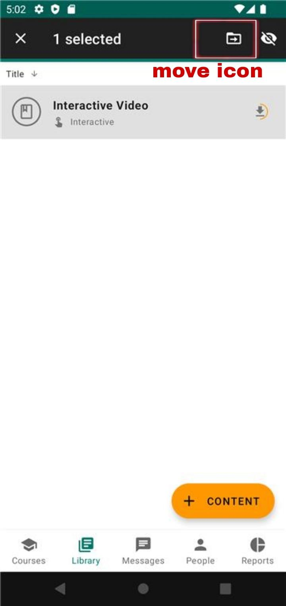
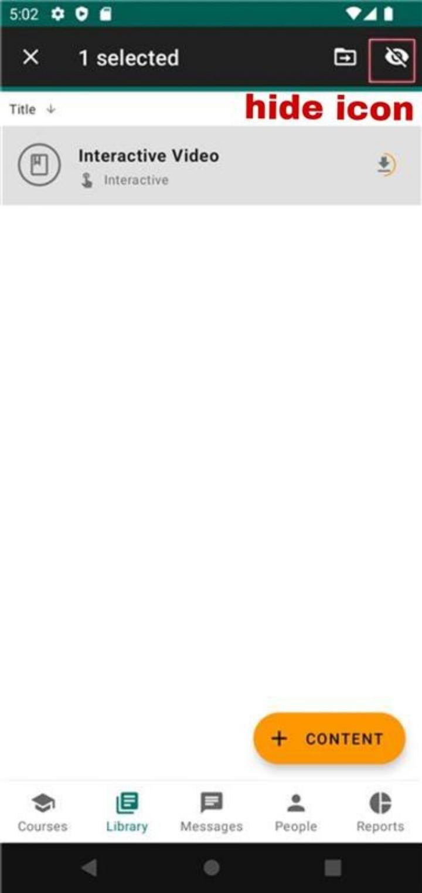

===========
CONTENT
===========

.. _addcontent:

Add a Content to library
----------------------------

To add a content to Library in Ustad Mobile, follow these steps:

#. Login as Admin User.
#. Click on the Library tab.
#. Click on the "+Content" button.
#. Click on the "Add file" button 
#. Select the content in the device.
#. Change the content title if needed.
#. Optionally, you can add additional information.
#. Click on the "Save" button to add the content to the library.
#. Locate the desired content and click on it to open the content details.
#. Click on "Open" button to open the content

The content block is now added to the module and will be visible to the course participants.

Add a Content to library using link
--------------------------------------

To add a content to Library in Ustad Mobile, follow these steps:

#. Login as Admin User.
#. Click on the Library tab.
#. Click on the "+Content" button.
#. Click on the "Add using link" button 
#. Enter the site link and click on "Next" button.
#. Change the content title if needed.
#. Optionally, you can add additional information.
#. Click on the "Save" button to add the content to the library.
#. Locate the desired content and click on it to open the content details.
#. Click on "Open" button to open the content

The content block is now added to the module and will be visible to the course participants.

Move a content
-----------------

Check out the above :ref:`Add a Content to library <addcontent>`  section to add a content to the library.

#. On the Library page locate the desired content and long press on it.
#. Click on "Move" icon on the title bar to move the content.
#. Click on the "Add a new content" button.
#. Click on the "New folder" button
#. Provide a title for the new content folder.
#. Optionally, you can add additional information.
#. Click on the "Save" button to add the content folder to the library.

Hide a content
-----------------

Check out the above :ref:`Add a Content to library <addcontent>`  section to add a content to the library.

#. On the Library page locate the desired content and long press on it.
#. Click on "Hide" icon on the title bar to hide content.

