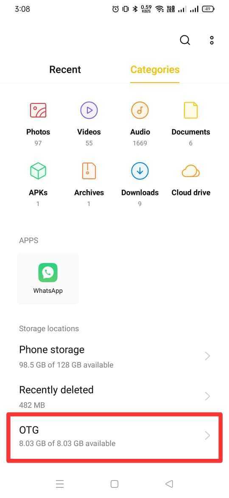
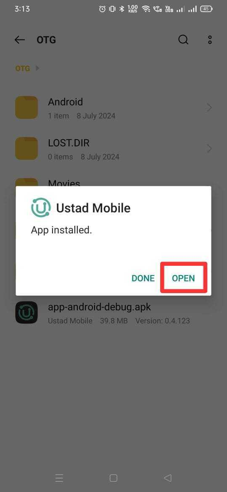
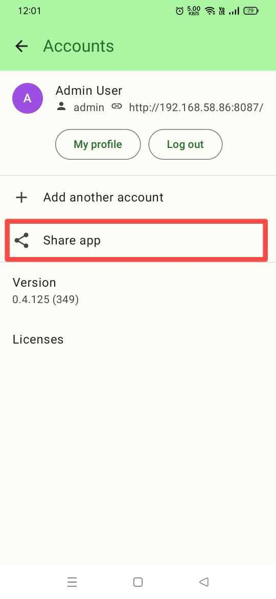
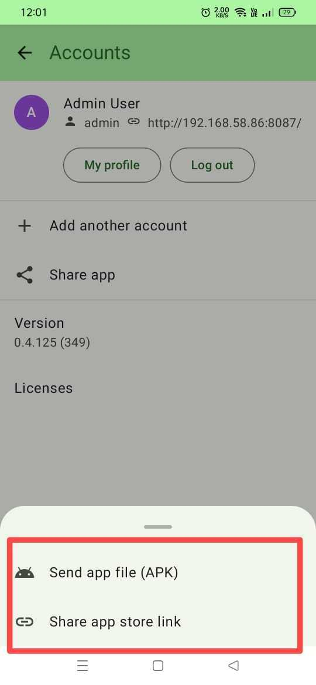

=======================
INSTALLATION
=======================

Android Installation
--------------------

This section covers various methods to install our application on Android devices.

Install from SD Card/Flash Drive
^^^^^^^^^^^^^^^^^^^^^^^^^^^^^^^^

To install the application using an SD card or flash drive:

1. Copy the APK file to your SD card or flash drive.
2. Insert the SD card or connect the flash drive to your Android device.
3. Use a file manager app to navigate to the APK file.
4. Tap on the APK file to begin the installation process.
5. If prompted, allow installation from unknown sources in your device settings.
6. Follow the on-screen instructions to complete the installation.

Offline Sharing
^^^^^^^^^^^^^^^

Our application supports various offline sharing methods for installation.

QuickShare
""""""""""

To install using QuickShare:

1. On the device with the app, open the app and go to "Share App" in settings.
2. Select "QuickShare" as the sharing method.
3. On the receiving device, open QuickShare and scan for nearby devices.
4. Select the sending device from the list of available devices.
5. Accept the file transfer on both devices.
6. Once the transfer is complete, tap on the received APK to install.

Share offline using Google Play
"""""""""""""""""""""""""""""""
You can share the app offline using Google Play as per `Google Play instructions <https://support.google.com/googleplay/answer/9283534?hl=en>`_.

Other Sharing Apps
""""""""""""""""""

You can also use other popular sharing apps to install our application:

1. On the device with the app, use your preferred file manager to locate the APK.
2. Long-press the APK and select "Share" from the options.
3. Choose your preferred sharing app (e.g., ShareIt, Xender, etc.).
4. On the receiving device, accept the incoming file transfer.
5. Once the transfer is complete, tap on the received APK to install.

Remember to enable installation from unknown sources in your Android settings before installing the APK through any of these methods.